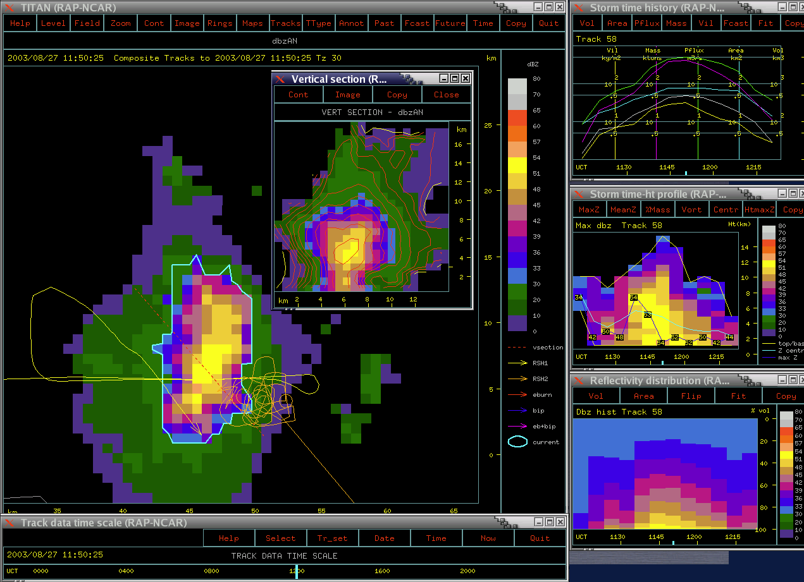
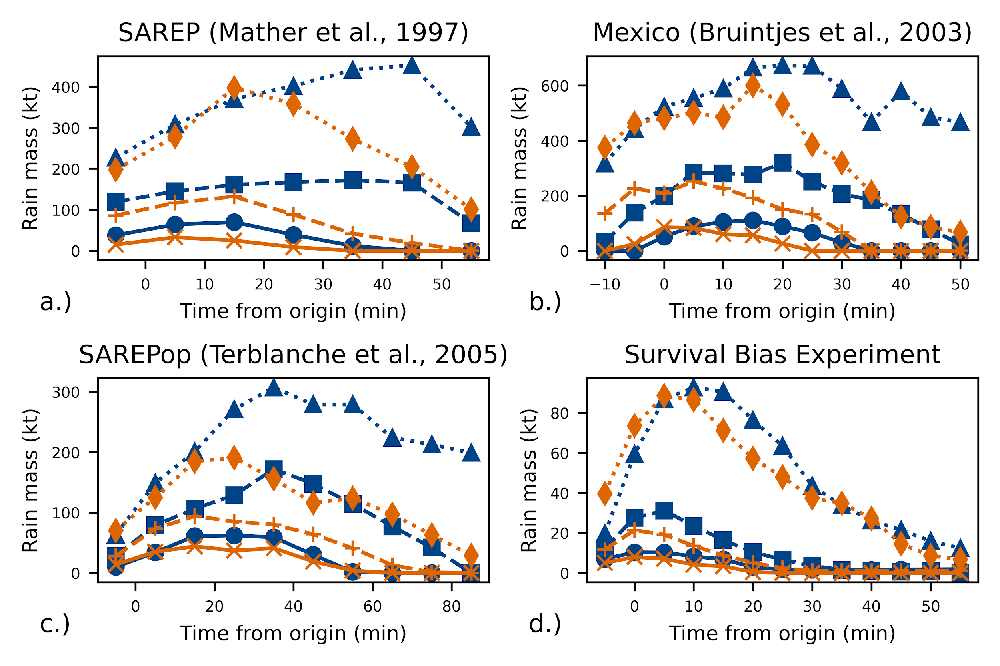
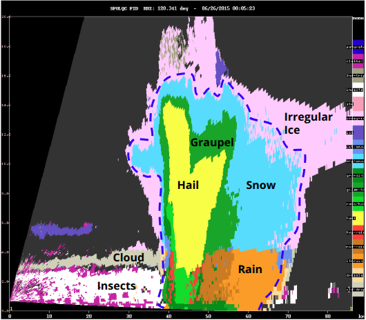

# Advancing Cloud Seeding Science with Dual-Polarization Radar Signatures and AI

**UAE Research Program for Rain Enhancement Science (UAEREP)**  
**Project period:** March 2026 – February 2029

## Project overview

The UAE operates a modern dual-polarization weather radar network and an active cloud-base hygroscopic seeding program for rainfall enhancement. This project is using those capabilities to address two broad challenges:

- **How can we better understand the processes and results of cloud seeding?**
- **How can we improve the effectiveness of seeding missions?**

The project is primarily a scientific software-engineering and research effort. It combines modern dual-polarization radar observations with the open-source **LROSE/TITAN** storm-analysis system, improved statistical methods, and physically constrained artificial intelligence.

The project is led by **Echo Science Works LLC, Colorado** in collaboration with **North-West University (NWU), South Africa** and the **National Center of Meteorology (NCM), United Arab Emirates**.

## Sponsor links

- [UAE-REP](https://www.uaerep.ae/)
- [6th cycle award](https://www.uaerep.ae/research-projects/author/profile?pID=385&locale=en)

## Three scientific questions

At its core, the project is driven by three questions:

### When are UAE storms actually seedable?

Cloud seeding is most likely to be effective during particular phases of storm development. By following the evolution of individual storms and their microphysical properties, we aim to identify favorable **seedability windows** and improve the timing and targeting of seeding missions.

### How do seeded storms differ microphysically from natural storms?

Dual-polarization radar allows us to examine storm properties that are much more closely related to cloud microphysics than conventional radar reflectivity alone. We will investigate the evolution of ZDR and KDP columns, hydrometeor types, ρHV signatures, precipitation, and other storm properties in seeded and unseeded convection.

### How much additional rainfall or storm lifetime can be credibly attributed to seeding?

Convective storms are naturally highly variable. Determining what would have happened to a particular storm without seeding is therefore a central scientific challenge. The project will combine storm-object analysis, statistical methods, and AI techniques to develop a more physically grounded and statistically defensible framework for evaluating seeding effects.

## TITAN and cloud-seeding evaluation

TITAN (Thunderstorm Identification, Tracking, Analysis and Nowcasting) was originally developed for cloud-seeding research and operations. For more than 30 years it has been used to identify individual convective storms in radar data, track them through their life cycles, and compute storm-based properties that can be related to aircraft tracks and seeding decisions.

The legacy LROSE Rview and TimeHist displays were developed to support these activities. They combine radar observations, storm tracks, aircraft tracks, vertical sections, and time histories of storm properties.

  

*Figure 1. Example of the legacy TITAN Rview and TimeHist displays.*

*Figure 1. Example of the legacy TITAN Rview and TimeHist displays. A major goal of the project is to replace these older interfaces with modern visualization and decision-support tools.*

Historically, TITAN storm analysis has been based primarily on radar reflectivity and Doppler velocity. These observations allow us to derive geometrically based or **macro-scale emergent properties** such as storm area, volume, estimated mass, precipitation mass, and rotation.

These properties have been used extensively for radar-based evaluation of cloud-seeding experiments. Storm properties can be aligned relative to the seeding decision time and compared statistically between seeded and unseeded cases.

*Figure 2. Examples of radar-based cloud-seeding evaluation using TITAN. The plots illustrate results from previous seeding experiments and also demonstrate the importance of accounting carefully for selection and survival biases.*

This approach has provided useful information, but reflectivity-based properties describe a storm mainly at the macro scale. The current project aims to move beyond these bulk properties and characterize the storm's evolving **microphysical structure**.

## What dual polarization adds

Over the past 15 years, many operational radar networks, including the UAE network, have been upgraded to dual polarization. These radars transmit and receive both horizontally and vertically polarized waves.

In addition to conventional reflectivity and Doppler velocity, dual-polarization radar provides several important measurements:

- **ZDR – differential reflectivity**, which provides information related to particle shape and size;
- **PHIDP – differential phase** between the horizontal and vertical radar signals;
- **KDP – specific differential phase**, which is particularly useful for identifying regions containing large concentrations of liquid water;
- **ρHV – copolar correlation coefficient**, which helps distinguish different hydrometeor types and mixed-phase regions.

These measurements allow us to examine both the macro-scale structure of a storm and its microphysical evolution.

For example, vertical **ZDR and KDP columns** can provide information about liquid water and particle growth within convective updrafts. Combining the radar fields with atmospheric temperature information also allows us to estimate **Particle Identification (PID)**, distinguishing regions dominated by rain, snow, graupel, hail, mixed-phase particles, and other hydrometeors.

*Figure 2. How dual-polarization radar can help to deduce the microphysical composition of a convective storm.

Dual polarization also improves radar-based **Quantitative Precipitation Estimation (QPE)**.

By incorporating these observations into TITAN, we can considerably expand the set of properties associated with each tracked storm. Examples include:

- ZDR and KDP column properties;
- rain, snow, ice, and graupel fractions;
- vertical distributions of hydrometeor types;
- improved precipitation estimates;
- microphysical transitions through the storm life cycle.

This provides a much richer physical description of each storm for both operational decision support and evaluation of possible seeding effects.

## What we are building

### Dual-polarization TITAN/LROSE

TITAN is being extended so that each tracked storm object includes dual-polarization microphysical properties as well as the traditional storm geometry and reflectivity-based measurements.

The project is also moving TITAN storm and track data from its historical specialized binary format toward a self-describing **NetCDF-4 data model**. This will make the data easier to exchange, archive, and analyze using modern scientific tools such as Python.

A three-dimensional Cartesian processing framework is being developed to combine:

- radar reflectivity and dual-polarization observations;
- KDP;
- Particle Identification (PID);
- precipitation rate and QPE;
- numerical weather prediction fields;
- terrain information; and
- radar beam-blockage information.

### Lucid visualization

A modern visualization application called **Lucid** is being developed to replace legacy LROSE displays originally created in the 1990s.

Lucid is based on modern C++ and Qt and is intended to integrate radar observations, TITAN storm tracks, dual-polarization products, aircraft or UAS tracks, model fields, satellite and surface observations, and AI-derived indicators in a common operational and analysis environment.

### Improved radar sampling

Conventional radar volume scans provide broad-area surveillance but relatively limited vertical sampling of individual convective storms.

The project will investigate a **dynamic scan-priority broker** that uses TITAN storm identification and nowcasting to identify storms of particular interest and recommend targeted vertical or sector scans. The goal is to improve observations where storm microphysics is changing most rapidly while preserving the surveillance responsibilities of the operational radar network.

### UAE storm archive

The project will develop a labelled archive of UAE convective storms, bringing together storm-object histories, dual-polarization microphysics, environmental information, and seeding decisions.

Subject to NCM data-sharing requirements, this archive is intended to become a long-term scientific resource for studying UAE convection, cloud microphysics, and cloud-seeding effectiveness.

## AI as a supporting tool

AI is **not intended to replace physical understanding or operational expertise**. Instead, it will learn from the behavior of physically meaningful TITAN storm objects to support better decisions and more defensible evaluation.

Three applications are of particular interest.

### Improved nowcasting

TITAN already provides physically based extrapolation of storm motion and evolution. Rather than replacing these forecasts, AI methods will be investigated as a way of learning their systematic errors.

The aim is to answer a question such as:

> Given this type of storm, its microphysical state, and its environment, how does the conventional TITAN forecast usually err?

The resulting system could provide probabilistic corrections to near-term forecasts of storm growth, decay, and motion.

### Seedability assessment

Seedability is not simply a yes/no property of a storm. It changes as the storm develops.

Short histories of storm-object properties — including growth rates, ZDR and KDP column strength, PID transitions, ρHV signatures, and environmental conditions — will be investigated as predictors of whether a storm is approaching a favorable seeding window.

### Evaluation and attribution

Traditional seeded-versus-unseeded storm matching can be sensitive to selection bias, decision time, and the natural variability of convection.

The project will investigate an alternative approach in which models learn the normal evolution of **unseeded storms** under different environmental conditions. The observed evolution of seeded storms can then be compared with the expected unseeded behavior.

Rather than asking only whether a seeded storm differs from a selected control storm, this approach asks:

> How far did this storm depart from the evolution we would have expected without seeding?

The objective is a physically interpretable, storm-object-based framework that explicitly represents uncertainty and makes use of the microphysical information available from dual-polarization radar.

## Expected science and impact

The project aims to produce more than a new set of software tools. The scientific goal is a better understanding of **when cloud seeding helps, when it does not, and why**, specifically for UAE storm environments.

Expected outcomes include:

- an operational, dual-polarization-aware TITAN/LROSE system at NCM;
- storm objects containing ZDR/KDP column properties, PID fractions, QPE, environmental information, and other microphysical indicators;
- improved understanding of the dual-polarization signatures and microphysical evolution of UAE convection;
- AI-assisted nowcasting and seedability indicators for real-time mission support;
- a more defensible framework for estimating possible seeding effects;
- a labelled UAE storm archive for research and algorithm development;
- the modern Lucid operational and analysis interface;
- a proof-of-concept dynamic radar scan-priority system;
- open and reproducible scientific software and documentation; and
- training and knowledge transfer supporting sustainable use and development of the technology.

In short, the project aims to make fuller use of the UAE's excellent radar infrastructure to create a **seeding-aware storm analysis system** combining dual-polarization microphysics, storm tracking, AI, and operational decision support.

## Project team

### Echo Science Works LLC

**Dr. Michael Dixon – Principal Investigator**

Echo Science Works leads the radar-software architecture and development, including LROSE/TITAN modernization, dual-polarization radar processing, storm-object analytics, visualization, and operational integration.

### North-West University

**Prof. Roelof Burger – Co-Principal Investigator**

North-West University contributes expertise in cloud-seeding science and evaluation, radar microphysics, statistical methodology, artificial intelligence and machine learning, and capacity building.

### National Center of Meteorology, UAE

NCM provides the operational context for the project, relevant UAE observations and infrastructure, and scientific and technical collaboration.

## Open science and software

A major objective of the project is to produce tools that are scientifically transparent, reproducible, and useful beyond an individual experiment.

The LROSE software ecosystem is open source and publicly available through GitHub. Project developments incorporated into LROSE will continue to follow its open-source development model.

Technical documentation, scientific publications, and appropriate research datasets will be made available as the project progresses, consistent with UAEREP and NCM requirements.

## Project updates

Project results, publications, software releases, conference presentations, and training materials will be added here as the work progresses.

### 2026

- **March 2026** – Project commenced.
- **April 2026** – Project presented at the Weather Modification Association annual meeting in Reno, Nevada.
- **April 2026** – One-day TITAN training workshop delivered at the Weather Modification Association meeting, including methods for cloud-seeding evaluation.
- **August 2026** – Work on robust KDP estimation for LROSE presented at the European Conference on Radar in Meteorology and Hydrology (ERAD 2026), Belgrade, Serbia.

---

## Acknowledgement

This material is based on work supported by the National Center of Meteorology, Abu Dhabi, UAE under the UAE Research Program for Rain Enhancement Science.

## Disclaimer

Any opinions, findings and conclusions or recommendations expressed in this material are those of the author(s) and do not necessarily reflect the views of the National Center of Meteorology, Abu Dhabi, UAE, funder of the research.
